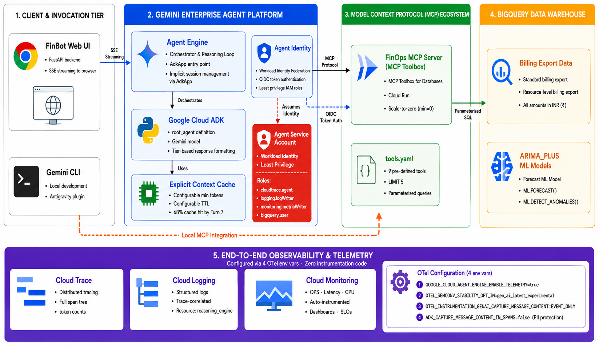
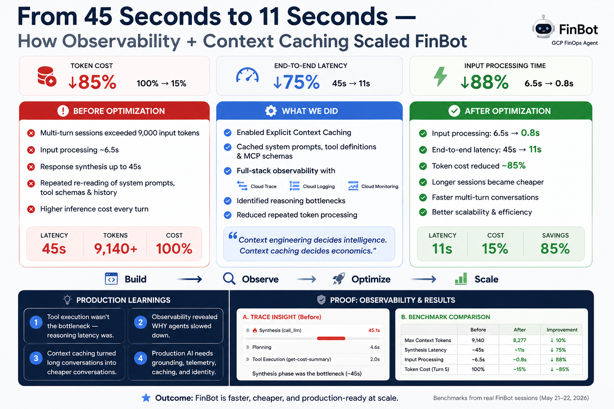
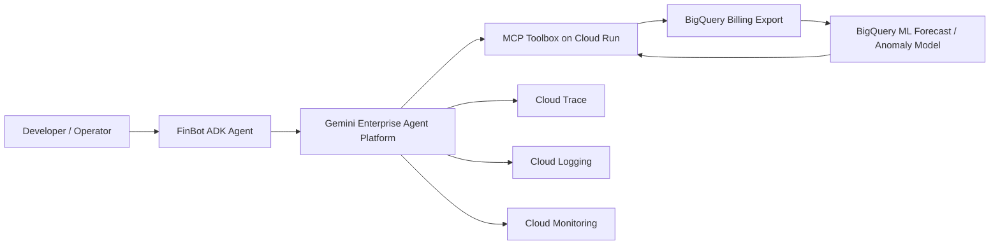

# Build. Observe. Scale.

Autonomous AI Agents with ADK, MCP Toolbox and Gemini Enterprise Agent Platform.

This repository contains the public resources from my first talk as a Google Developer Expert at AI Weekend: Build with AI 2026 by Google Developer Groups Sharjah, hosted alongside MENA Blockchain Week at Hadron Founders Club, Dubai.

## Core Idea

Anyone can build an AI agent.

The real challenge is operating an AI agent you can trust in production.

This session focused on the production layer around agents: context, grounding, tools, observability, governance, reliability and scale.

## Resources

| Resource | Link |
|---|---|
| Slides PDF | [slides/Build_Observe_Scale.pdf](slides/Build_Observe_Scale.pdf) |
| Editable deck | [slides/Build_Observe_Scale.pptx](slides/Build_Observe_Scale.pptx) |
| Architecture diagram | [assets/finbot-architecture.png](assets/finbot-architecture.png) |
| Observability results | [assets/finbot-observability-results.png](assets/finbot-observability-results.png) |
| FinBot demo agent | [demos/finops-cloud-agent](demos/finops-cloud-agent) |
| MCP Toolbox sample config | [toolbox/tools.example.yaml](toolbox/tools.example.yaml) |
| Mermaid architecture source | [diagrams/architecture.mmd](diagrams/architecture.mmd) |
| Session notes | [docs/session-notes.md](docs/session-notes.md) |
| MCP client integration | [docs/mcp-client-integration.md](docs/mcp-client-integration.md) |
| References | [docs/references.md](docs/references.md) |

## What Was Covered

- Context engineering for autonomous agents.
- Grounding agents with real enterprise data.
- Tool execution using MCP Toolbox.
- Agent development with ADK.
- Deployment on Gemini Enterprise Agent Platform.
- Observability across logs, traces and metrics.
- Governance, reliability and production readiness.
- FinOps use case: billing analysis, anomaly detection, forecasting and recommendations.

## Demo: FinBot

FinBot is a GCP FinOps agent that connects to Google Cloud billing data through MCP Toolbox and helps answer questions such as:

- What are the top cost drivers this month?
- Which projects are responsible for most spend?
- Did we have unusual cost spikes?
- What is the forecasted spend for the next 30 days?
- Which unlabeled resources create governance risk?

The demo shows how an agent can combine:

- ADK for agent orchestration.
- MCP Toolbox for governed tool access.
- BigQuery billing export for grounded data.
- BigQuery ML for forecasting and anomaly detection.
- Gemini Enterprise Agent Platform for deployment.
- Cloud Trace, Cloud Logging and Cloud Monitoring for observability.

The token and latency analysis was also explored as an agentic workflow in Gemini CLI, using MCP-connected Google Cloud context to inspect Agent Runtime traces turn by turn and compare baseline vs cached sessions.

You can connect the same MCP Toolbox layer directly to Gemini CLI or an MCP-compatible AI IDE. See [docs/mcp-client-integration.md](docs/mcp-client-integration.md).

## Prerequisites

Before running the demo, make sure you have the following:

- A Google Cloud project with billing enabled.
- Cloud Billing export enabled to BigQuery.
- A BigQuery dataset containing billing export tables.
- Optional: a BigQuery ML `ARIMA_PLUS` model for forecast and anomaly tools.
- Google Cloud SDK installed and authenticated.
- Application Default Credentials configured:

```bash
gcloud auth application-default login
gcloud config set project <your-gcp-project-id>
```

- MCP Toolbox installed locally or deployed to Cloud Run.
- IAM access for the identity running MCP Toolbox:
  - `roles/bigquery.dataViewer`
  - `roles/bigquery.jobUser`
- If using MCP Toolbox on Cloud Run, caller access:
  - `roles/run.invoker`
- Local developer tools:
  - `uv`
  - `agents-cli`
  - optional: `adk`

Setup order:

1. Enable Cloud Billing export to BigQuery.
2. Confirm billing export tables exist in BigQuery.
3. Configure MCP Toolbox using [toolbox/tools.example.yaml](toolbox/tools.example.yaml).
4. Run MCP Toolbox locally or deploy it to Cloud Run.
5. Point the agent or AI client to the MCP endpoint.
6. Run the ADK agent, Gemini CLI, or another MCP-compatible client.

## Architecture



## Observability and Context Caching Results



## Repository Structure

```text
.
├── README.md
├── assets/
│   ├── README.md
│   ├── finbot-architecture.png
│   └── finbot-observability-results.png
├── slides/
│   └── README.md
├── diagrams/
│   ├── README.md
│   └── architecture.mmd
├── docs/
│   ├── README.md
│   ├── mcp-client-integration.md
│   ├── publishing-checklist.md
│   ├── references.md
│   └── session-notes.md
├── toolbox/
│   ├── README.md
│   └── tools.example.yaml
├── screenshots/
│   ├── README.md
│   ├── agent-platform-cache-spans.png
│   ├── agent-runtime-trace-dag.png
│   ├── gemini-cli-latency-comparison.png
│   └── gemini-cli-token-savings.png
└── demos/
    ├── README.md
    └── finops-cloud-agent/
        ├── app/
        │   ├── README.md
        │   ├── agent.py
        │   └── instructions.md
        ├── config/
        │   ├── README.md
        │   ├── dev.env.example
        │   └── prod.env.example
        ├── pyproject.toml
        └── README.md
```

## Quick Start

Clone the repository:

```bash
git clone https://github.com/onkar17/build-observe-scale-agents.git
cd build-observe-scale-agents/demos/finops-cloud-agent
```

Install dependencies:

```bash
agents-cli install
```

Configure MCP Toolbox:

```bash
cp config/dev.env.example config/dev.env
export TOOLBOX_URL=http://localhost:8080
```

`TOOLBOX_URL` must point to a running MCP Toolbox server configured with billing tools similar to [toolbox/tools.example.yaml](toolbox/tools.example.yaml).

Run with Agents CLI:

```bash
agents-cli playground
```

Alternative ADK commands:

```bash
uv run adk run app
uv run adk web .
```

Use `agents-cli playground` for the most reliable local path in this project. `adk run app` is useful for a CLI chat loop. `adk web .` starts the ADK web UI for the current agents directory, but it still requires `TOOLBOX_URL` and Google credentials to be configured.

## Configuration

Copy an example config file:

```bash
cp config/dev.env.example config/dev.env
```

Then update:

- `PROJECT`
- `REGION`
- `TOOLBOX_REGION`
- observability environment variables if needed

For MCP Toolbox, copy `toolbox/tools.example.yaml` and replace:

- `GCP_PROJECT_ID`
- `BILLING_EXPORT_DATASET`
- table names if your billing export uses a different pattern

Do not commit real `.env` files, service account keys, billing account IDs or private project metadata.

## Deployment Notes

The demo agent is structured for deployment to Gemini Enterprise Agent Platform / Vertex AI Agent Engine using Agents CLI.

Typical flow:

```bash
gcloud config set project <your-gcp-project-id>
agents-cli deploy
agents-cli publish gemini-enterprise
```

You need:

- Google Cloud project with required APIs enabled.
- Billing export dataset in BigQuery.
- MCP Toolbox deployed to Cloud Run.
- IAM permissions for Agent Engine, Cloud Run, BigQuery, Cloud Trace, Cloud Logging and Cloud Monitoring.

## Mermaid Architecture Source



## Publishing Checklist

Before sharing publicly, review [docs/publishing-checklist.md](docs/publishing-checklist.md).

Most important:

- Export the final deck as PDF and add it to `slides/`.
- Blur private details in screenshots.
- Keep only sanitized sample SQL in `toolbox/`.
- Confirm there are no `.env`, credential, token, deployment metadata or billing account files.

## Connect

- LinkedIn: https://www.linkedin.com/in/onkar17
- Medium: https://medium.com/@onkar17

## License

MIT License. See [LICENSE](LICENSE).
